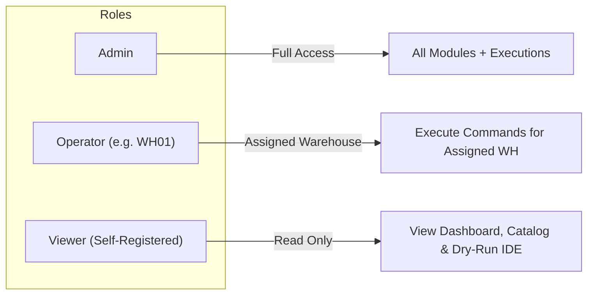

# WICL Engine — Full Working Procedure & Architecture Guide

Welcome to the **Warehouse Inventory Command Language (WICL) Platform**. This document provides an exhaustive technical and operational walkthrough of the system architecture, compiler pipeline stages, database schemas, authentication & RBAC models, frontend IDE capabilities, and end-to-end workflow procedures.

---

## 1. System Overview & Architectural Diagram

WICL is a **compiler-based warehouse inventory control engine**. Instead of traditional manual forms, inventory mutations are specified via domain-specific domain commands (WICL syntax), validated through a multi-stage compiler, and transactionally committed to a relational database.

```mermaid
graph TD
    User["User / Operator (Browser IDE)"] -->|Raw WICL String| API["FastAPI Backend (/api/commands/process)"]
    
    subgraph Compiler Pipeline Engine
        API --> Stage1["Stage 1: Canonicalizer & Lexer"]
        Stage1 -->|Tokens Stream| Stage2["Stage 2: BNF Recursive Parser"]
        Stage2 -->|Abstract Syntax Tree| Stage3["Stage 3: Semantic Analyzer"]
        Stage3 -->|Validated AST + Context| Stage4["Stage 4: Execution Engine"]
    end
    
    subgraph Persistence Layer (SQLite / SQLAlchemy)
        Stage3 -.->|Read & Validate Stock/Limits| DB[(Relational DB)]
        Stage4 -->|ACID Transaction Commit| DB
    end
    
    Stage4 -->|Execution Result + Audit Log| API
    API -->|Structured Response JSON| User
```

---

## 2. The 5-Stage Compiler Pipeline

The core of WICL is a formal compiler pipeline located in `backend/app/compiler/`.

```
Raw Input String ──> Canonicalizer & Lexer ──> Parser ──> Semantic Analyzer ──> Execution Engine
```

### Stage 1: Canonicalization & Lexical Analysis (`lexer.py`)
1. **Punctuation Stripping**: Strips trailing semicolons `;` or commas `,`.
2. **Shorthand Expansion**: Preprocesses shorthand user input into formal BNF syntax:
   - `ADD 50 LAPTOP001 TO WH01` $\rightarrow$ `ADD ITEM LAPTOP001 QUANTITY 50 LOCATION WH01`
   - `TRANSFER 20 MOUSE001 FROM WH01 TO WH02` $\rightarrow$ `TRANSFER ITEM MOUSE001 QUANTITY 20 FROM WH01 TO WH02`
   - `CHECK MONITOR001 IN WH03` $\rightarrow$ `CHECK ITEM MONITOR001 LOCATION WH03`
   - `REMOVE 5 KEYBOARD001 FROM WH04` $\rightarrow$ `REMOVE ITEM KEYBOARD001 QUANTITY 5 LOCATION WH04`
3. **Tokenization**: Scans characters left-to-right into typed `Token` objects (`KEYWORD`, `IDENTIFIER`, `NUMBER`, `EOF`, or `INVALID`).
4. **Token Storage**: Persists all scanned tokens into the `token_records` table for deep audit inspection.

### Stage 2: Recursive Descent Syntax Analysis (`parser.py`)
1. **Grammar Matching**: Matches token sequences against context-free BNF rules:
   - **ADD**: `ADD ITEM <ITEM_ID> QUANTITY <NUMBER> LOCATION <WH_ID>`
   - **REMOVE**: `REMOVE ITEM <ITEM_ID> QUANTITY <NUMBER> LOCATION <WH_ID>`
   - **TRANSFER**: `TRANSFER ITEM <ITEM_ID> QUANTITY <NUMBER> FROM <SRC_WH> TO <DST_WH>`
   - **CHECK**: `CHECK ITEM <ITEM_ID> LOCATION <WH_ID>`
   - **UPDATE**: `UPDATE ITEM <ITEM_ID> QUANTITY <NUMBER> LOCATION <WH_ID>`
2. **AST Generation**: On matching grammar, constructs strongly typed Abstract Syntax Tree (AST) nodes (`AddCommandNode`, `TransferCommandNode`, etc.).
3. **Syntax Errors**: Emits `SYN001` (premature EOF / expected token missing) or `SYN004` (invalid command verb).

### Stage 3: Semantic Analysis (`semantic_analyzer.py`)
Validates business logic and database constraints without mutating data:
1. **Existence Rule (`SEM_001_EXISTENCE`)**: Verifies item and warehouse IDs exist in database.
2. **Stock Availability Rule (`SEM_002_STOCK`)**: For `REMOVE` and `TRANSFER`, checks if source warehouse has sufficient stock ($Q_{\text{available}} \ge Q_{\text{requested}}$).
3. **Warehouse Capacity Rule (`SEM_003_CAPACITY`)**: For `ADD` and `TRANSFER`, ensures destination warehouse capacity won't be exceeded ($Q_{\text{current}} + Q_{\text{new}} \le \text{Capacity}$).
4. **Role Permission Rule (`SEM_004_RBAC`)**: Enforces operator warehouse boundaries (e.g. operators bound to `WH01` cannot issue commands for `WH02`).

### Stage 4: Transactional Execution Engine (`executor.py`)
1. **ACID Mutation**: Executes state changes within a database transaction block.
2. **Audit Logging**: Inserts an immutable transaction record into the `transactions` table (`ADD`, `REMOVE`, `TRANSFER`, `CHECK`, `UPDATE`).
3. **Status Update**: Sets command record `overall_status` to `"completed"` (if executed) or `"validated"` (if dry-run analyzed).

---

## 3. Database Schema & Models

The SQLite database (`warehouse.db`) is configured with the following tables:

| Table | Purpose | Key Attributes |
| :--- | :--- | :--- |
| `users` | User accounts & RBAC roles | `id`, `username`, `password_hash`, `role` (`admin`/`operator`/`viewer`), `warehouse_id` |
| `warehouses` | Storage facilities | `id`, `warehouse_code` (e.g. `WH01`), `name`, `location`, `capacity`, `status` |
| `items` | Product catalog | `id`, `item_code` (e.g. `LAPTOP001`), `item_name`, `category`, `status` |
| `inventory` | Stock quantities per warehouse | `id`, `item_id`, `warehouse_id`, `quantity`, `updated_at` |
| `commands` | Compiler execution logs | `id`, `user_id`, `raw_command`, `overall_status`, `created_at` |
| `transactions` | Ledger of committed stock moves | `id`, `command_id`, `user_id`, `item_id`, `source_warehouse_id`, `destination_warehouse_id`, `quantity`, `transaction_type` |
| `error_records` | Compiler error details | `id`, `command_id`, `error_stage`, `error_code`, `message`, `position` |
| `token_records` | Scanned lexical tokens | `id`, `command_id`, `lexeme`, `token_type`, `position` |

---

## 4. User Roles & Permission Matrix (RBAC)



| Action / Module | Admin | Operator | Viewer |
| :--- | :---: | :---: | :---: |
| **Sign-Up (`/register`)** | Default Viewer | Default Viewer | Self-Service |
| **View Dashboard & Reports** | Yes | Yes | Yes |
| **Dry-Run Analysis (IDE)** | Yes | Yes | Yes |
| **Execute Command (IDE)** | Yes | Yes (Assigned WH) | No (Disabled) |
| **Manage Catalog & Stock** | Yes | Yes | No |
| **Manage Warehouses** | Yes | View Only | View Only |
| **User Administration** | Yes | No | No |

---

## 5. End-to-End User Procedure Workflow

### Procedure A: Self-Service Registration & Login
1. Navigate to `http://localhost:5173/register`.
2. Enter a username (3–32 characters, alphanumeric/underscores) and a password (min. 6 characters).
3. The password strength meter displays real-time feedback (Fair / Strong).
4. Click **Create account**. You are registered with the `Viewer` role and logged into the platform automatically.

### Procedure B: Running a Dry-Run Command Analysis
1. Navigate to **Command Processor** (`/commands`).
2. Type or select a command preset (e.g. `ADD 50 LAPTOP001 TO WH01;`).
3. Click **Dry Run (Analyze)**.
4. Inspect the **Compiler Pipeline Inspector**:
   - **Stage Breakdown**: View pass/fail status across Lexer, Parser, and Semantic checks.
   - **Tokens Stream**: Inspect character positions and classified token types.
   - **AST Graph**: View the hierarchical Abstract Syntax Tree structure.
   - **Raw JSON**: Inspect full payload returned by compiler engine.

### Procedure C: Executing an Inventory Mutation
1. Log in with an `admin` or `operator` account (`admin` / `admin123`).
2. Navigate to **Command Processor** (`/commands`).
3. Type an inventory command, e.g.:
   ```sql
   TRANSFER 20 MOUSE001 FROM WH01 TO WH02;
   ```
4. Click **Execute Command**.
5. The execution engine performs an atomic transaction, updates stock levels in `WH01` and `WH02`, and generates a transaction record (e.g. `TXN-42`).
6. Navigate to **Inventory** (`/inventory`) or **Transactions** (`/transactions`) to verify updated stock numbers.

---

## 6. How to Run the Application Locally

### Prerequisites
- Python 3.10+
- Node.js 18+ & npm

### Step 1: Start FastAPI Backend
```powershell
cd "c:\Users\LENOVO\Downloads\warehouse CD\backend"
python -m uvicorn app.main:app --reload --port 8000
```
- API Base URL: `http://localhost:8000`
- Swagger Interactive Docs: `http://localhost:8000/docs`

### Step 2: Start Vite React Frontend
```powershell
cd "c:\Users\LENOVO\Downloads\warehouse CD\frontend"
npm run dev
```
- Web Application URL: `http://localhost:5173`

### Step 3: Reseed Demo Data (Optional)
```powershell
cd "c:\Users\LENOVO\Downloads\warehouse CD\backend"
python seed.py
```
Default Credentials:
- **Admin**: `admin` / `admin123`
- **Operator 1**: `operator1` / `op123`
- **Viewer**: `viewer` / `view123`
